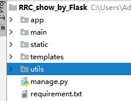
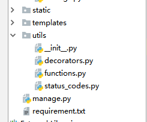

>   auth: zhangminglu
>
>   datetime: 2018-03-25 20:45
>
>   Email: 1367000465@qq.com
>
>   Github: https://github.com/zhangMingLu
>
>   CSDN: https://blog.csdn.net/zhang_ming_lu

### 介绍

一个简单的flask框架的基本组成，可以有效的避免每次创建flask项目是配置很多的文件，方便快捷。

### 文件树构成

#### 使用方法

1.  直接将文件克隆下来，修改文件名称为你的项目名字
2.  在app文件目录下创建你自定义的 views.py, 并且将路由注册在 main  文件目录下的 create_app.py 中
3.  main 文件目录下的 ext_init.py 为帮助 创建初始化 app
4.  main 文件目录下的 settings.py 为放置配置文件，数据库的配置，session, config 的自定义内容都在这里更改。
5.  static 文件目录用于放置静态文件
6.  templates 文件目录用于放置网页模板
7.  utils 文件目录下的 decorators.py 放置自定以的装饰器， 这里放了一个我自己写的验证登录的装饰器，如果想自定义，可以将其删除。
8.  utils 文件目录下的 functions.py 用于放置自定义的功能函数
9.  utils 文件目录下的 status_codes.py 用来放置自定义的状态码，方便后期管理
10.  最后还应该在项目的文件目录下创建一个 doc 文件目录，放置API 接口文档。 

>   希望这个模板可以帮助到你，欢迎clone和fork，有问题请 pull reques 
>
>   另外：我在 templates 中放置了一个 用户的登录注册的模板页面，在 static 文件中也有其对应的静态文件， 如果你不需要，将其删除即可， 同时删除 user_views.py 即可。

2018.7.10 

添加日志记录模块

添加[七牛云](utils/image_storage.py)存储照片 

添加[云通讯](utils/sms.py)来接收短信